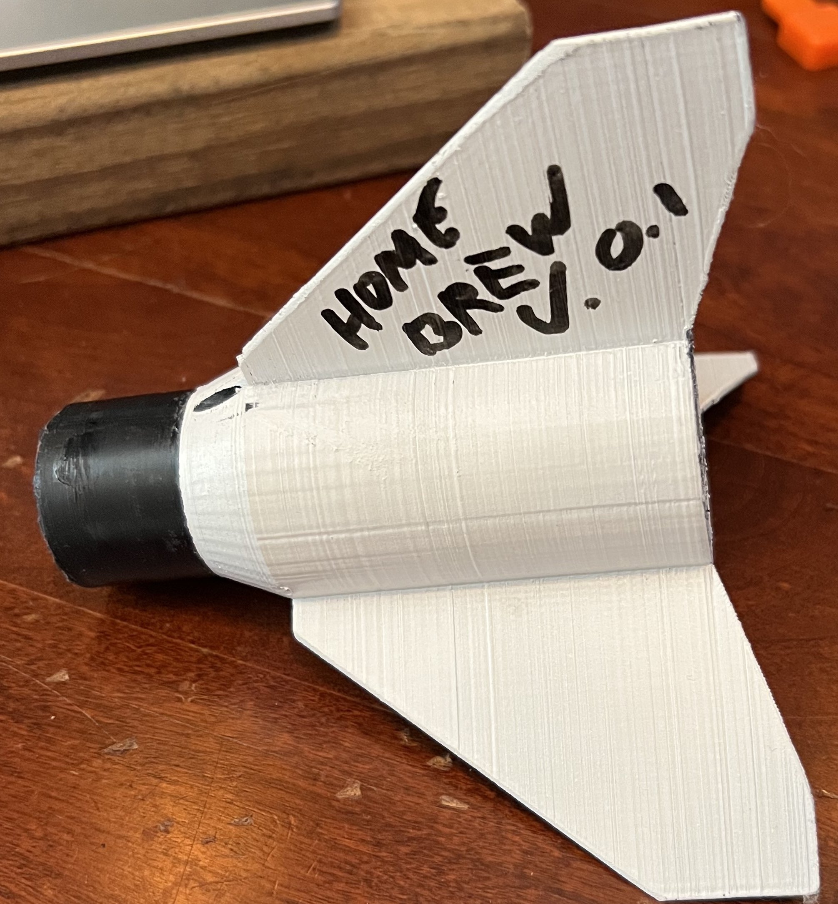

# Fun with home made rockets 

The goal of this project is learn about rocketry, have some fun with my kids and give me another avenue to work on hardware specific software.

# homebrew v0.1
home brew v0.1 is what I call a "hybrid."  Its part model, cardboard tube, probably a factory estes nose cone.  The only thing that was 3d printed was the fin can.  You'd print the fin can, then glue it into a peice of estes body tube.  This fin can takes 3 A motors.  We under powered it when we launched it and it was distasterous.  We only tried to launch it once before moving on.  You can find a lot of .stl files here in homebrew_v0.1, I dont remember exactly which combination we printed and flew but it gave me a lot of experience with drawing things in solid works.

# Origin
The first rocket that we flew was a prebuilt Estes Rip Tide kit that my wife got us for Christmas at the end of 2020.  We flew it a bunch and then flew some smaller Swift models, then a Cherokee E.  Sometime after that we started drawing up parts in cad and printing them.  It took awhile before we launched home printed parts.