# Fun with home made rockets 

The goal of this project is learn about rocketry, have some fun with my kids and give me another avenue to work on embedded software.

## homebrew BE1 v0.1 v0.2 fully printed 
This series covers the first of our full printed body tubes.

The first print of this rocket was launched on a F motor and we lost the airframe in some woods, I dont have any pictures of it.

v0.2 expected to fly by the end of the summer 2022.
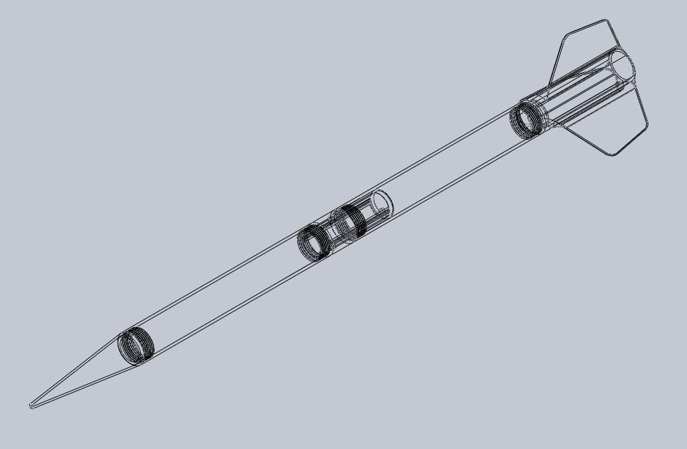
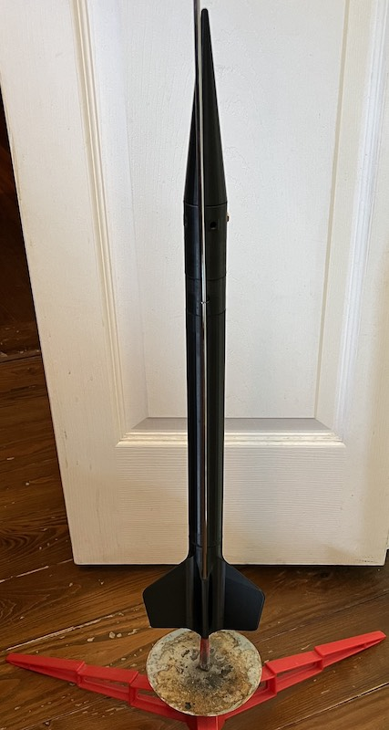
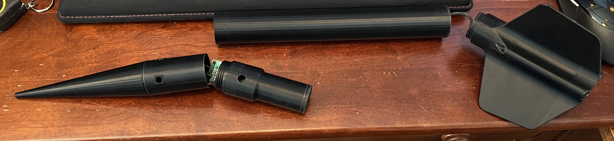
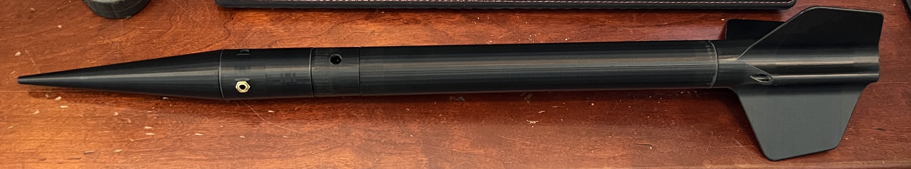

This is designed where you can make it as large as you want.  You can put two of the body tubes together or just run it with one tube.

The files include:

    1. threaded nose cone
    2. button adapter - small adapter that can go behind the nose cone to put buttons on
    3. eggtimer ebay
    4. female coupler
    5. fincan - estes F15 motor size, I also have spacers to step down to an E or D motor
    6. body tube - you can print multiple of these and chain them together

## homebrew v0.2/3/4/5 hybrids

This is a set of rockets with printed nose cones, fin cans, adapters, launch lugs and ebays but with cardboard body tubes.

We have flown this set a lot more than what the flight data sheets say, we were just a little bit lazy with our documentation at the time.
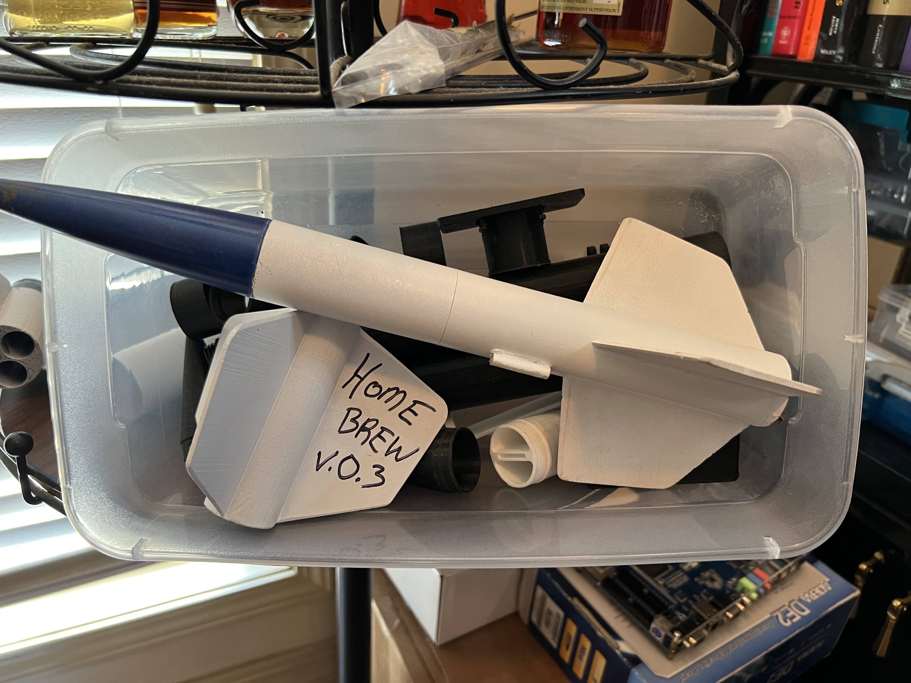

### v0.5 -> big scary 
Flight Data Sheet:
11-13-21 1 D12-7, 1 D12-5 and 1 E12-6 flight, all these flew well but looks like we had trouble with the eggtimer.

### v0.4 -> cato-lac
Flight Data Sheet:
11-13-21 predicted 600' on a D-12 and only went 377 on eggtimer
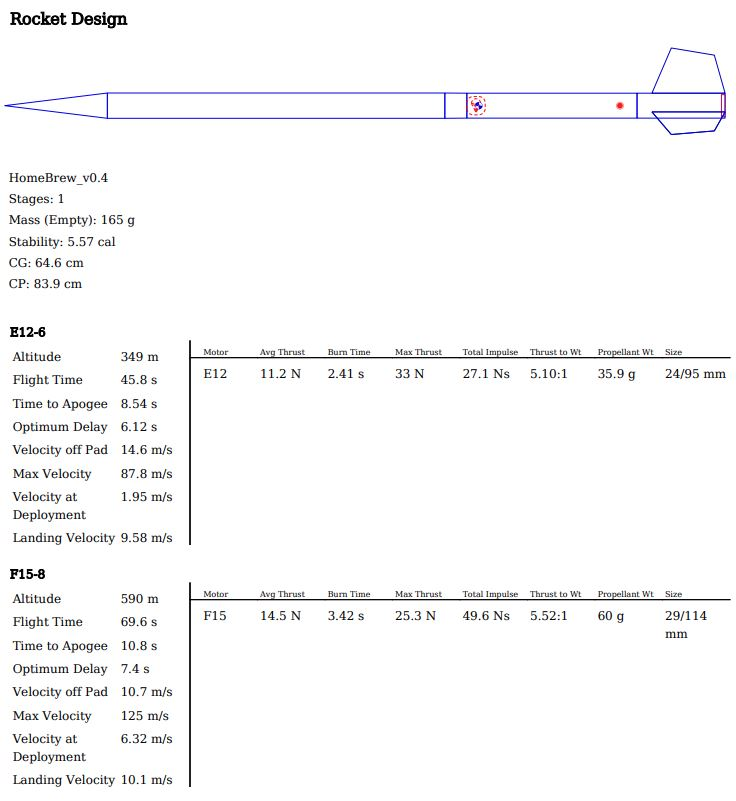

### v0.3 -> no name
This rocket is of the same design as v0.2 no changes I believe.  We started printing "rod rings", little rings you could slide over the body tube to attach the rocket to the launch rod.  This saved us from having to buy cardboard launch lugs.  Around this time we got a bad batch of E motors and had several cato's with 2 & 3.  At this time we started designing and printing our own nose cones as well as our own electronics bays to hold an eggtimer.
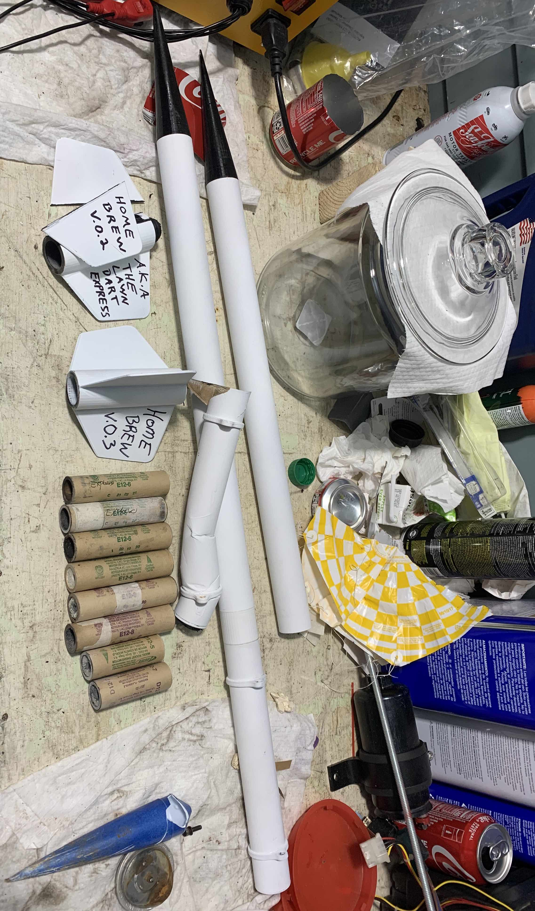
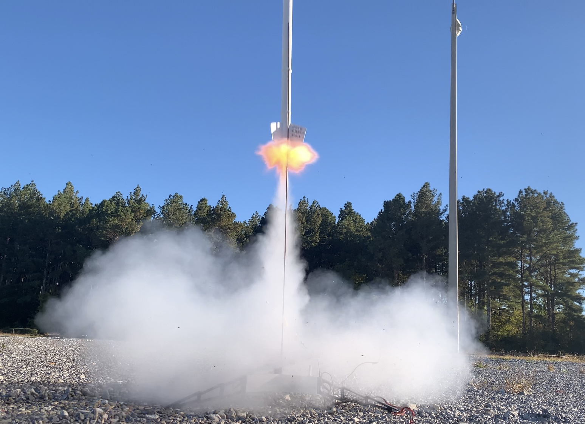

Flight Data Sheet:
11/8/21 we had estimated this to go 1000' on an e12-6 and the eggtimer logged 1218'

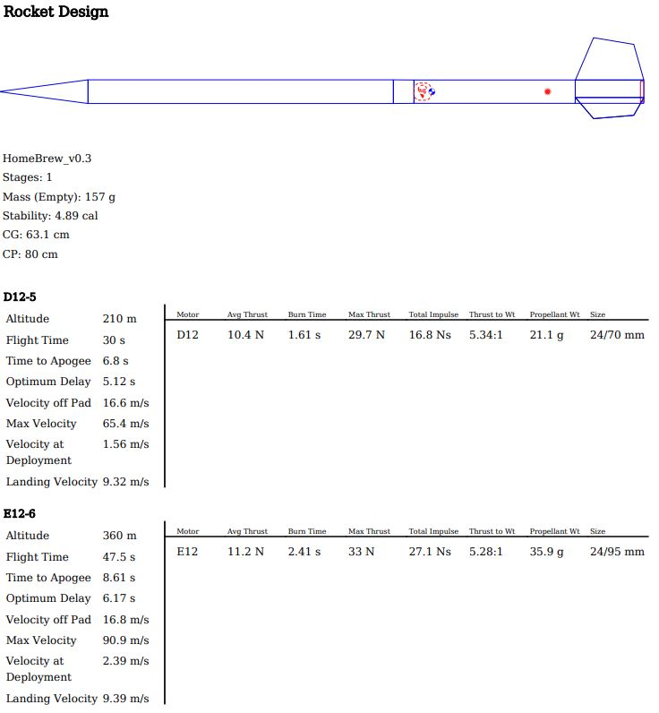

### v0.2 -> lawn dart express
This rocket is still a hybrid but had a screw on fin can.  It had a small boss that you could glue into the back of a body tube then screw the fin can into. You could test different fin designs or motor combinations without changing the main part of the body.  We flew it several times mostly on E motors till eventually we knocked the fins off it.
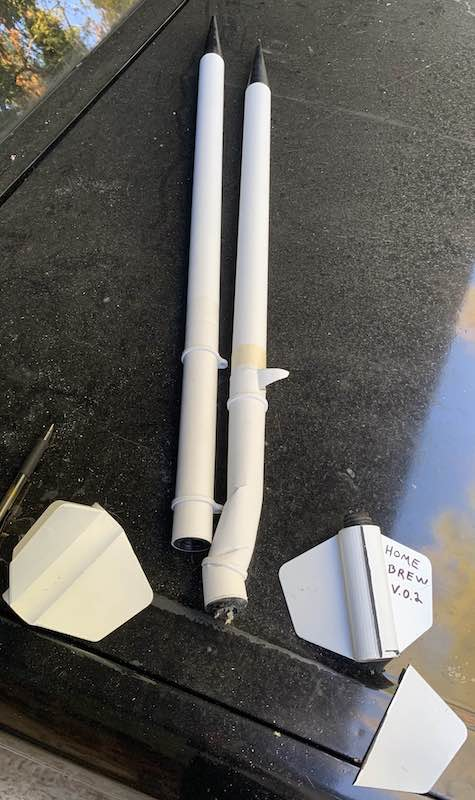

Flight Data Sheet:
11-8-21 we tried to launch twice on a nice day with two different e12-6's and both exploded lol.

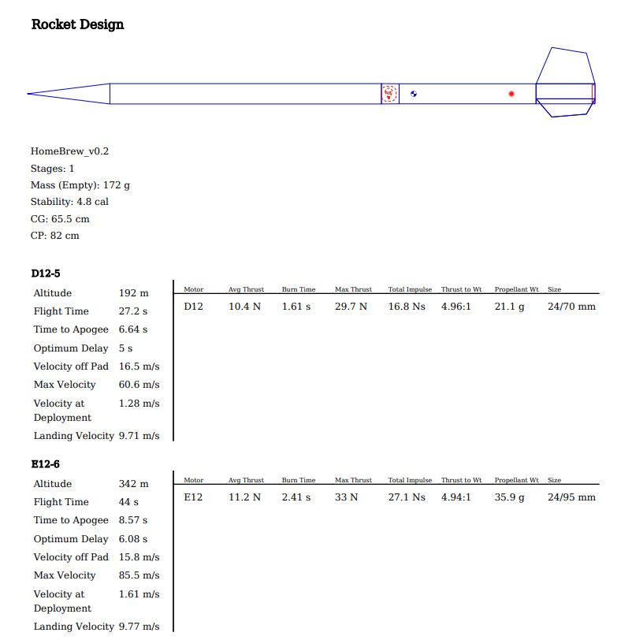

## homebrew v0.1
home brew v0.1 is what I call a "hybrid."  Its part model, cardboard tube, probably a factory estes nose cone.  The only thing that was 3d printed was the fin can.  You'd print the fin can, then glue it into a peice of estes body tube.  This fin can takes 3 A motors.  We under powered it when we launched it and it was distasterous.  We only tried to launch it once before moving on.  You can find a lot of .stl files here in homebrew_v0.1, I dont remember exactly which combination we printed and flew but it gave me a lot of experience with drawing things in solid works.

# Estes Rip Tide 
The first rocket that we flew was a prebuilt Estes Rip Tide kit that my wife got us for Christmas at the end of 2020.  We flew it a bunch and then flew some smaller Swift models, then a Cherokee E.  Sometime after that we started drawing up parts in cad and printing them.  It took awhile before we launched home printed parts.